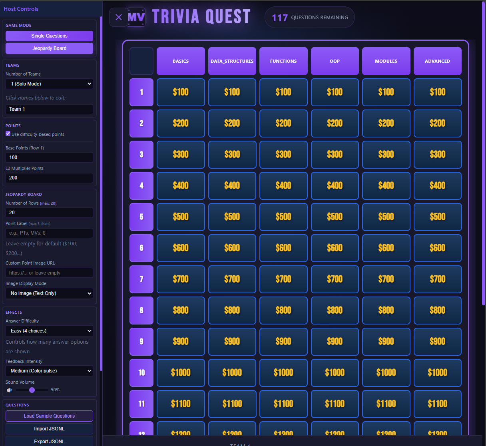

# Trivia Quest



## About

A simple trivia quiz web application built with modern web technologies.

## Getting Started

Works Offline, python local server, docker.

1. Clone the repository
2. Open `index.html` in your browser
3. Start answering questions!

### Docker Build

```bash
docker compose up -d --build
```

### Python Local Server

```bash
python -m http.server 8000
```
