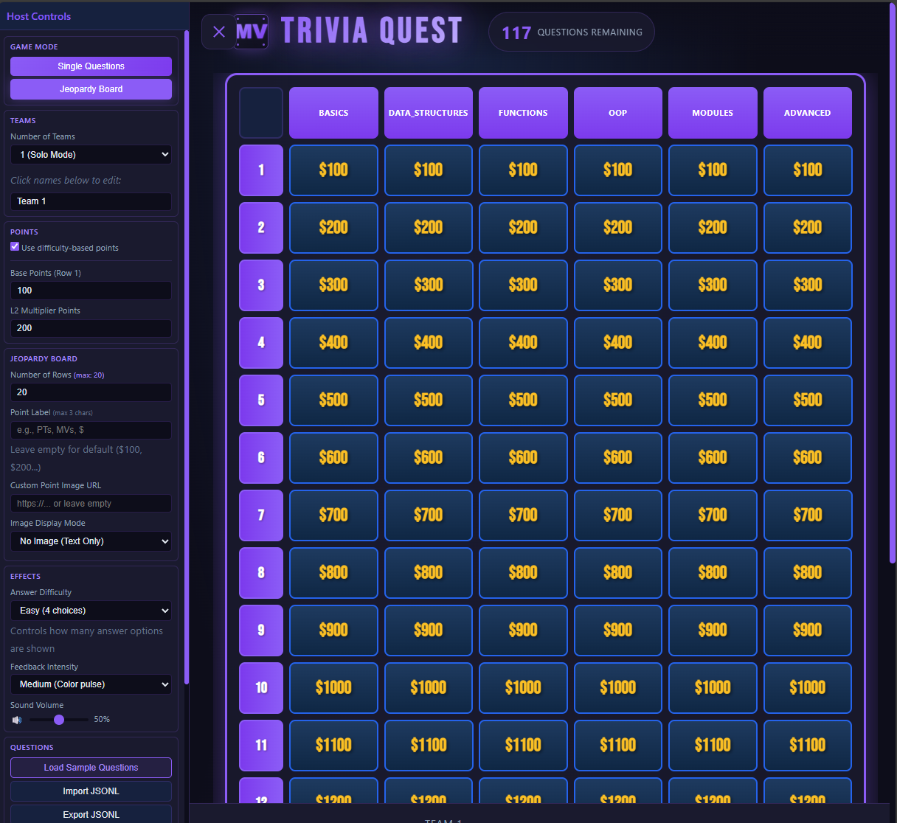

# Trivia Quest



## About

A trivia quiz web application.

## Getting Started

### Docker Build

To add new question categories or banks to the database, you only need to create/add a new JSONL to question_bank/ and run the build command. The files in the question bank are imported on docker build. 

If you need a template, just add any question from the WebApp and export it to get the format.

#### Docker Hub
```powershell
docker pull jonesckevin/trivia-quest:latest

docker run --rm -p 3023:80 `
  -e "APP_TITLE=test quest" `
  -e "JWT_SECRET=change-me-this-should-be-32-chars-minimum-for-security!" `
  -e "SECRET_KEY=change-me-this-should-be-32-chars-minimum-for-security!" `
  -e "ADMIN_PASSWORD=admin123" `
  -e "ACCOUNTS_ENABLED=false" `
  -e "REQUIRE_USER_PASSWORD=false" `
  -e "MAX_UPLOAD_MB=25" `
  jonesckevin/trivia-quest:latest
```

#### Docker Build
```bash
docker compose up -d --build
```

### Python Local Server

```bash
start-server.ps1
# OR
python -m http.server 8000
```

Then open your browser to http://localhost:3002/ (or 8000 if using Python's http.server)

Or use the helper scripts:

```powershell
# Start server (builds database automatically)
.\start-server.ps1

# Custom port
.\start-server.ps1 -Port 3000

# Custom title
.\start-server.ps1 -Title "My Trivia Game"

# Skip database rebuild (use existing)
.\start-server.ps1 -SkipDB
```

```bash
# Start server (builds database automatically)
./start-server.sh

# Custom port
./start-server.sh 3000

# Custom title
./start-server.sh --title "My Trivia Game"

# Skip database rebuild (use existing)
./start-server.sh --skip-db
```
Then open your browser to http://localhost:8080/

